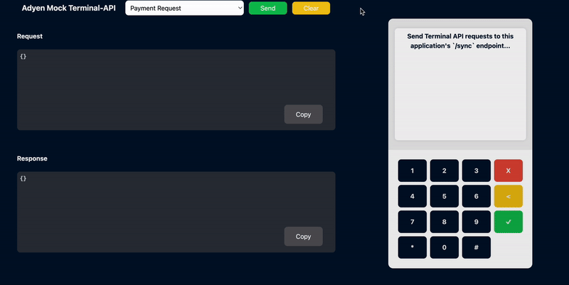

> **[!IMPORTANT]** This mock application is currently in its alpha-release and is **not** supporting every terminal-api request and response. This application **cannot** reject all invalid requests.
> 
> **Always test** your request and responses on your own physical terminal device first. 

# Adyen Mock Terminal-API Application
The Adyen Mock Terminal-API Application is a mock server that handles incoming requests and returns hard-coded responses. The application matches the request by looking at the `SaleToPOIRequest.MessageCategory`-field and returns the respective response, see `/public/payloads/...`-folder.

This tool can be used by developers to quickly end-to-end test their application by sending having their application send requests to the Mock Terminal API Application (`http://localhost:3000/sync`) instead of the Adyen servers. You can do this by overriding the `CloudApiEndpoint` on the client (config) of your application.

Currently, we use the Mock Terminal-API Application to [end-to-end test](https://github.com/adyen-examples/adyen-testing-suite/tree/main/tests/in-person-payments) our in-person payments integration-examples in [**.NET**](https://github.com/adyen-examples/adyen-dotnet-online-payments/tree/main/in-person-payments-example), [**Java**](https://github.com/adyen-examples/adyen-java-spring-online-payments/tree/main/in-person-payments-example) or [**Node.js**](https://github.com/adyen-examples/adyen-node-online-payments/tree/main/in-person-payments-example).



[](https://gitpod.io/#https://github.com/adyen-examples/adyen-mock-terminal-api)
[](https://app.codeanywhere.com/#https://github.com/adyen-examples/adyen-mock-terminal-api)

### Basics
We currently support the following [Terminal API requests/responses](https://docs.adyen.com/point-of-sale/design-your-integration/terminal-api/) below.


|                                                                                                                                                            Request | Response                                                                                                                                                             | Description                                                                                                                          |
|-------------------------------------------------------------------------------------------------------------------------------------------------------------------:|:---------------------------------------------------------------------------------------------------------------------------------------------------------------------|--------------------------------------------------------------------------------------------------------------------------------------|
|                     [PaymentRequest](https://docs.adyen.com/point-of-sale/design-your-integration/terminal-api/terminal-api-reference/#comadyennexopaymentrequest) | [PaymentResponse](https://docs.adyen.com/point-of-sale/design-your-integration/terminal-api/terminal-api-reference/#comadyennexopaymentresponse)                     | A successful payment request.                                                                                                        |
|                   [ReversalRequest](https://docs.adyen.com/point-of-sale/design-your-integration/terminal-api/terminal-api-reference/#comadyennexoreversalrequest) | [ReversalResponse](https://docs.adyen.com/point-of-sale/design-your-integration/terminal-api/terminal-api-reference/#comadyennexoreversalresponse)                   | A successful reversal request.                                                                                                       |
| [TransactionStatusRequest](https://docs.adyen.com/point-of-sale/design-your-integration/terminal-api/terminal-api-reference/#comadyennexotransactionstatusrequest) | [TransactionStatusResponse](https://docs.adyen.com/point-of-sale/design-your-integration/terminal-api/terminal-api-reference/#comadyennexotransactionstatusresponse) | A successful transaction-status request.                                                                                             |
|                                                                                                                                                                    | [PaymentBusyResponse](https://docs.adyen.com/point-of-sale/design-your-integration/terminal-api/terminal-api-reference/#comadyennexopaymentresponse)                 | Returned when the payment terminal is waiting for pin.                                                                               |
|                         [AbortRequest](https://docs.adyen.com/point-of-sale/design-your-integration/terminal-api/terminal-api-reference/#comadyennexoabortrequest) |                                                                                                                                                                      | Cancel an in-progress payment. **Note:** Only cancels the payment request. Parameters may slightly differ depending on the terminal. | 

### Declined payments
In general, test payments generate the result Approved. To simulate declined payments, you can change the last three digits of the `RequestedAmount` that you specify in the payment request.
- We constructed the mock payloads using a `V400M-` terminal device.
- We used the `Blue-green Adyen point-of-sale test card` (card inserted & pin entered, no tap) to retrieve the responses.

We currently support the following [Payment Refusal Codes](https://docs.adyen.com/point-of-sale/testing-pos-payments/test-card-v1/#testing-declines), see below.


|  Amount ending in | Result       | Error Condition | Refusal Reason         | Message                                                                                                                                            |
|------------------:|--------------|-----------------|------------------------|----------------------------------------------------------------------------------------------------------------------------------------------------|
|           **124** | Failure      | Refusal         | 210 Not enough balance | NOT_ENOUGH_BALANCE                                                                                                                                 |
|           **125** | Failure      | Refusal         | 199 Card blocked       | BLOCK_CARD                                                                                                                                         |
|           **126** | Failure      | Refusal         | 228 Card expired       | CARD_EXPIRED                                                                                                                                       |
|           **127** | Failure      | Refusal         | 214 Declined online    | INVALID_AMOUNT                                                                                                                                     |
|           **128** | Failure      | InvalidCard     | 214 Declined online    | INVALID_CARD                                                                                                                                       |
|           **134** | Failure      | WrongPIN        | 129 Invalid online PIN | INVALID_PIN - **Remark:** The terminal shows "Incorrect PIN" and then "Enter PIN". Cancel the payment on the terminal to get the failure response. |

When an invalid JSON is provided, an `invalidJsonObjectNotificationResponse` is returned.


## Prerequisites
- Node.js 18+ 

> We recommend to use an application that can send Terminal-API requests or one of our [**.NET**](https://github.com/adyen-examples/adyen-dotnet-online-payments/tree/main/in-person-payments-example), [**Java**](https://github.com/adyen-examples/adyen-java-spring-online-payments/tree/main/in-person-payments-example), [**Node.js**](https://github.com/adyen-examples/adyen-node-online-payments/tree/main/in-person-payments-example) example-integrations.

## 1. Installation

```
git clone https://github.com/adyen-examples/adyen-mock-terminal-api.git
```


## 2. Run the Application

```
npm install
npm start
```

Visit [http://localhost:3000/](http://localhost:3000/) to see the mock Terminal API.

## 3. Usage

There are two ways in which you can use the application.

1. We recommend to clone one of our In-Person Payment Integration examples in [**.NET**](https://github.com/adyen-examples/adyen-dotnet-online-payments/tree/main/in-person-payments-example), [**Java**](https://github.com/adyen-examples/adyen-java-spring-online-payments/tree/main/in-person-payments-example) or [**Node.js**](https://github.com/adyen-examples/adyen-node-online-payments/tree/main/in-person-payments-example).

Once you've cloned the example, you can point the application to use `http://localhost:3000`, this configurable by overriding the `CloudApiEndpoint` URI. Now your application is ready to communicate to the terminal


2. Alternatively, you can use this stand-alone application and send terminal API requests from within the application.


### Run Docker Image

You can also run the `adyen-mock-terminal-api` in a Docker container which exposes the application on port 3000 (default).


```
  # Run on Mac (i.e. --platform linux/arm64/v8)
 docker run --rm -d --name adyen-mock-terminal-api -p 3000:3000 -e PORT=3000 ghcr.io/adyen-examples/adyen-mock-terminal-api:main
```


## Contributing

We commit all our new features directly into our GitHub repository. Feel free to request or suggest new features or code changes yourself as well! Find out more in our [contributing](https://github.com/adyen-examples/.github/blob/main/CONTRIBUTING.md) guidelines.


### Example: Add your own mock request/response payload

1. Fork this repository and create a new branch.
2. The example below adds `paymentRequest.json` and `paymentResponse.json`. The `src/routes/services/payloadService` will automatically load these files, if it's suffixed with `*Request`/`*Response` **and** if the JSON is valid.
   - Create a new folder, in this example we use the existing **{payment}**-folder.
   - Add your `Request` to `/public/payloads/**{payment}**/paymentRequest
   - Add your `Response` to `/public/payloads/**{payment}**/paymentResponse
   - **Note:** Every `*Request` should have a `*Response`, except for those that require some kind of state or logic (f.e: "paymentBusyResponse" triggers when a payment request is in-progress).
   - **Note 2:** Keep naming-conventions camelCased and prefixed with its root-folder. Example: if the root-folder is located in `/payloads/example`, we name the jsons accordingly: `exampleRequest.json`/`exampleResponse.json`. 
3. In `/src/routes/defaultRoutes.js`, find the `/sync`-endpoint and add the logic needed to map your requests-and-responses.

```js
if (req.body.SaleToPOIRequest.Request) {
    sendOKResponse(res, "payment");
    return;
}

if (req.body.SaleToPOIRequest.ExampleRequest) {
   sendOKResponse(res, "example");
   return;
}
```
3. Open a [Pull Request](https://github.com/adyen-examples/adyen-mock-terminal-api/compare) with your changes.


## License

MIT license. For more information, see the **LICENSE** file.
