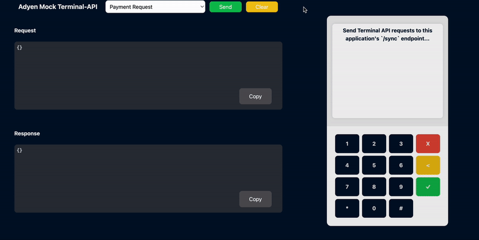

> [!IMPORTANT]
> This mock application is currently in its alpha-release and is not supporting every request and response. This application is **not** able to reject all invalid requests.
>
> We currently support the following [Terminal API requests](https://docs.adyen.com/point-of-sale/design-your-integration/terminal-api/):
> - [PaymentRequest](https://docs.adyen.com/point-of-sale/design-your-integration/terminal-api/terminal-api-reference/#comadyennexopaymentrequest) | [PaymentResponse](https://docs.adyen.com/point-of-sale/design-your-integration/terminal-api/terminal-api-reference/#comadyennexopaymentresponse) |  [PaymentBusyResponse](https://docs.adyen.com/point-of-sale/design-your-integration/terminal-api/terminal-api-reference/#comadyennexopaymentresponse) 
> - [ReversalRequest](https://docs.adyen.com/point-of-sale/design-your-integration/terminal-api/terminal-api-reference/#comadyennexoreversalrequest) | [ReversalResponse](https://docs.adyen.com/point-of-sale/design-your-integration/terminal-api/terminal-api-reference/#comadyennexoreversalresponse)
> - [AbortRequest](https://docs.adyen.com/point-of-sale/design-your-integration/terminal-api/terminal-api-reference/#comadyennexoabortrequest)
> - [TransactionStatusRequest](https://docs.adyen.com/point-of-sale/design-your-integration/terminal-api/terminal-api-reference/#comadyennexotransactionstatusrequest)  | [TransactionStatusResponse](https://docs.adyen.com/point-of-sale/design-your-integration/terminal-api/terminal-api-reference/#comadyennexotransactionstatusresponse)


# Adyen Mock Terminal-API Application
The Adyen Mock Terminal-API Application is a mock server that handles incoming requests and returns hard-coded responses.
Developers can use this to test their application quickly by sending their requests to the Mock Terminal-API Application (`localhost:3000`) instead of the Adyen servers.
This application is **not** able to reject all invalid requests.

Currently, the Mock terminal is used to [end-to-end test](https://github.com/adyen-examples/adyen-testing-suite/tree/main/tests/in-person-payments) our In-Person Payments Integration Examples in [**.NET**](https://github.com/adyen-examples/adyen-dotnet-online-payments/tree/main/in-person-payments-example), [**Java**](https://github.com/adyen-examples/adyen-java-spring-online-payments/tree/main/in-person-payments-example) or [**Node.js**](https://github.com/adyen-examples/adyen-node-online-payments/tree/main/in-person-payments-example).



[](https://gitpod.io/#https://github.com/adyen-examples/adyen-mock-terminal-api)


## Prerequisites
- Node.js 18+ 

> We recommend to use an application that can send Terminal-API requests or one of our [**.NET**](https://github.com/adyen-examples/adyen-dotnet-online-payments/tree/main/in-person-payments-example), [**Java**](https://github.com/adyen-examples/adyen-java-spring-online-payments/tree/main/in-person-payments-example), [**Node.js**](https://github.com/adyen-examples/adyen-node-online-payments/tree/main/in-person-payments-example) example-integrations.

## 1. Installation

```
git clone https://github.com/adyen-examples/adyen-mock-terminal-api.git
```


## 2. Run the Application

```
npm install
npm start
```

Visit [http://localhost:3000/](http://localhost:3000/) to see the mock Terminal API.

## 3. Usage

There are two ways in which you can use the application.

1. We recommend to clone on of our our In-Person Payment Integration examples in [**.NET**](https://github.com/adyen-examples/adyen-dotnet-online-payments/tree/main/in-person-payments-example), [**Java**](https://github.com/adyen-examples/adyen-java-spring-online-payments/tree/main/in-person-payments-example) or [**Node.js**](https://github.com/adyen-examples/adyen-node-online-payments/tree/main/in-person-payments-example).

Once you've cloned the example, you can point the application to use `http://localhost:3000`, this configurable by overriding the `CloudApiEndpoint` URI. Now your application is ready to communicate to the terminal


2. Alternatively, you can use this stand-alone application and send terminal API requests from within the application.


### Run Docker Image

You can also run the `adyen-mock-terminal-api` in a Docker container which exposes the application on port 3000 (default).


```
  # Run on Mac (i.e. --platform linux/arm64/v8)
 docker run --rm -d --name adyen-mock-terminal-api -p 3000:3000 -e PORT=3000 ghcr.io/adyen-examples/adyen-mock-terminal-api:main
```


## Contributing

We commit all our new features directly into our GitHub repository. Feel free to request or suggest new features or code changes yourself as well! Find out more in our [contributing](https://github.com/adyen-examples/.github/blob/main/CONTRIBUTING.md) guidelines.


### Example: Add your own mock request/response payload

1. Fork this repository and create a new branch.
2. The example below adds `paymentRequest.json` and `paymentResponse.json` (prefixed by `payment`). The `src/routes/services/payloadService` will automatically add this payload if the JSON is valid.
   - Add your `Request` to `/public/payloads/**{payment}**/paymentRequest
   - Add your `Response` to `/public/payloads/**{payment}**/paymentResponse
   - Note: Every `-Request` should have a `-Response`. Except for those that require some kind of (state) logic (f.e. "paymentBusyResponse" triggers when a payment request is in-progress).
3. In `/src/routes/defaultRoutes.js`, find the `/sync`-endpoint and the following code snippet:

```js
if (req.body.SaleToPOIRequest.PaymentRequest) {
    sendResponse(res, "payment");
    return;
}
```
3. Open a [Pull Request](https://github.com/adyen-examples/adyen-mock-terminal-api/compare) with your changes.


## License

MIT license. For more information, see the **LICENSE** file.
